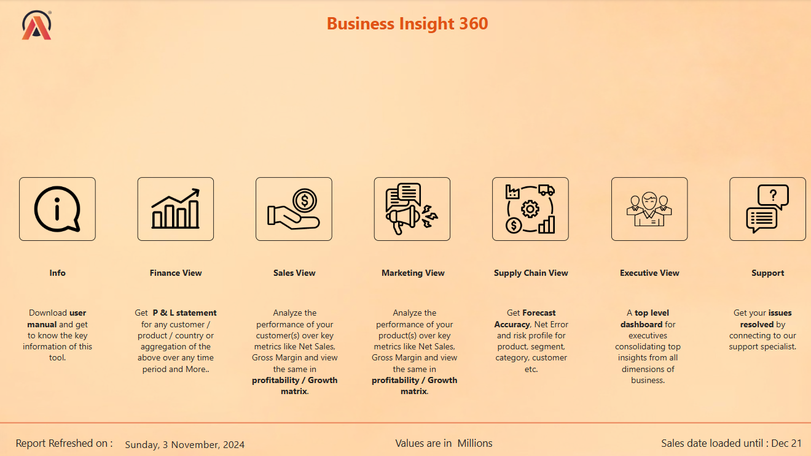
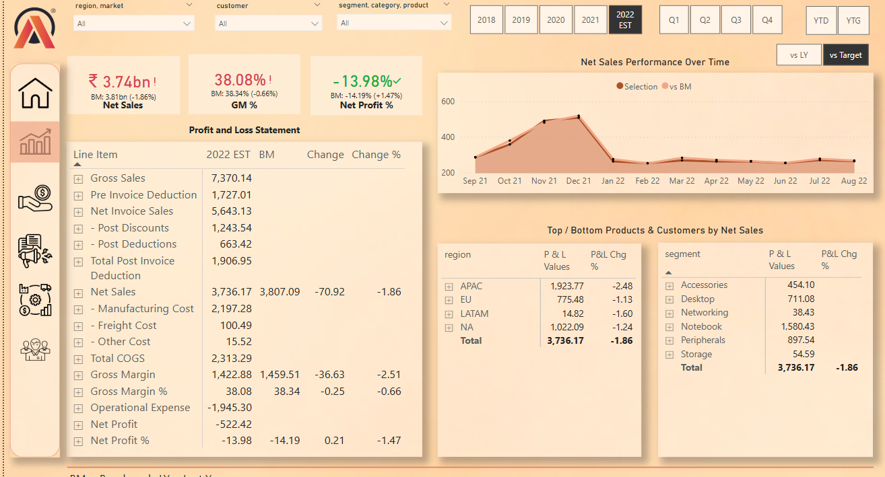
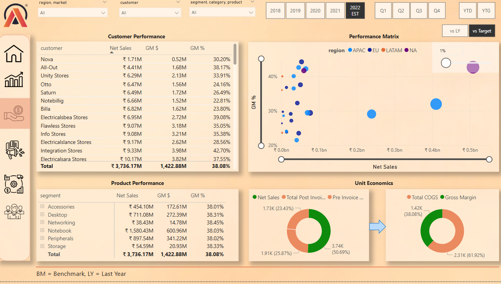
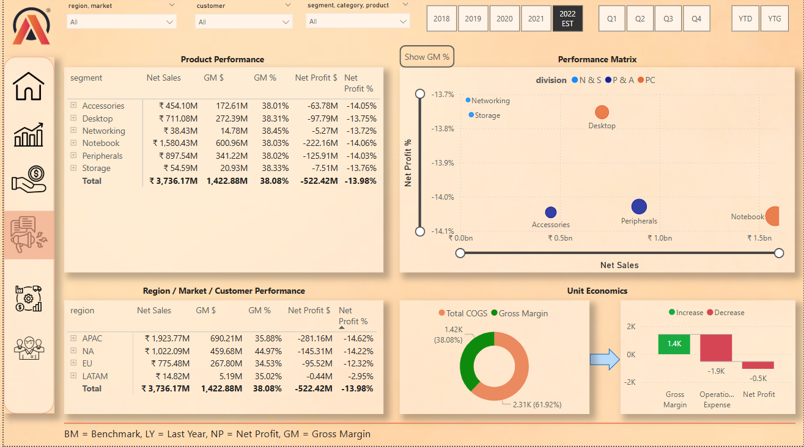
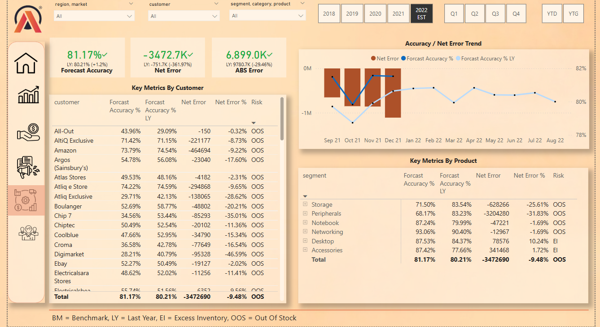
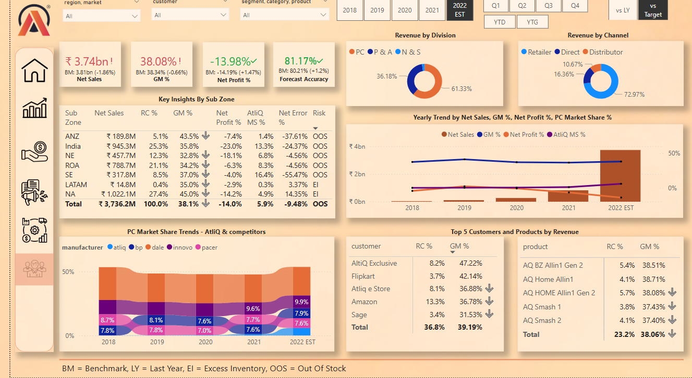

# Business Insights 360 - Power BI Dashboard

## **Table of Content**
- [Objective](#objective)
- [Business Context](#business-context)
- [Key Business Questions Answered](#key-business-questions-answered)
- [Key Insights](#key-insights)
- [Tools and Techniques Used](#tools-and-techniques-used)
- [Techniques](#techniques)
- [Dataset Overview](#dataset-overview)
- [Dashboard Features](#dashboard-features)
- [Live Dashboard](#live-dashboard)
- [How This Project Stands Out](#how-this-project-stands-out)
- [About Me](#about-me)

## **Objective**
To provide actionable insights for AtliQ Hardware by addressing challenges in financial performance, sales optimization, and supply chain efficiency through an interactive Power BI dashboard. This project highlights how data-driven decision-making can transform a growing business's operations and profitability.

## **Business Context**
AtliQ Hardware, a company specializing in the manufacturing and distribution of computer hardware and peripherals, faced challenges due to outdated Excel-based analytics. These challenges led to inefficiencies, including significant losses. To address this, the **Business Insights 360** project was initiated, leveraging Power BI to create a comprehensive, cross-functional dashboard with insights into:
- Finance
- Sales
- Marketing
- Supply Chain
- Executive Decision-Making

## **Key Business Questions Answered**
1. What are the key drivers of financial performance across regions and products?
2. Which customers and products are contributing most to revenue and profitability?
3. How can sales strategies be optimized to enhance performance?
4. How accurate are the company’s demand forecasts, and where are the risks?
5. What high-level KPIs are needed for executive decision-making?

## **Key Insights**
- **Finance**: The Profit & Loss statement revealed a -13.98% drop in Net Profit %, driven by increased operational expenses in LATAM.
- **Sales**: Notebooks were the highest revenue-generating segment, while Networking had the lowest Gross Margin %.
- **Marketing**: APAC achieved the highest ROI, while LATAM campaigns require reevaluation due to low profitability.
- **Supply Chain**: Forecast Accuracy stood at 81.17%, with LATAM facing significant Out-of-Stock (OOS) issues.
- **Executive Summary**: The dashboard consolidates KPIs such as revenue contributions, market share trends, and top-performing customers/products.

## **Tools and Techniques Used**
### **Tools**
- **Power BI**: Dashboard creation, interactive visuals, and analysis.
- **DAX**: Advanced calculations and measures.
- **MySQL**: Data extraction.
- **Excel**: Supplemental data handling.

### **Techniques**
- ETL (Extract, Transform, Load) process for data preparation.
- Data Modeling with Star and Snowflake schema for structured relationships.
- Advanced DAX calculations to derive insights.
- Interactive visuals with slicers, filters, bookmarks, and tooltips for enhanced user experience.

## **Dataset Overview**

### Customer Dimension
- 74 customers with 209 stores across 27 markets.
- **Channels**: Retailer, Direct, Distributor.

### Market Dimension
- 27 markets across 7 sub-zones within 4 regions: APAC, EU, NA, LATAM.

### Product Dimension
- 3 divisions: Networking & Storage, Peripherals & Accessories, PC.
- 6 segments and 14 categories of products.

### Fact Tables
- **Monthly Sales**: Tracks product-wise and customer-wise sales.
- **Forecast Data**: Includes predictions for demand and inventory planning.

### Supplementary Data
- **Market Share**: Competitive analysis at market level.
- **Operational Expenses**: Ad spends and operational costs.
- **Targets**: Fiscal benchmarks provided by management.

## **Dashboard Features**
### **1. Home View**
- A central navigation hub with a user manual and support resources.

  

### **2. Finance View**
- Provides detailed Profit & Loss (P&L) statements, gross margin trends, and net profit breakdowns.
- 

### **3. Sales View**
- Highlights top and bottom-performing customers/products.
- Tracks Net Sales and Gross Margin % across regions and categories.

  

### **4. Marketing View**
- Analyzes product and regional performance.
- Evaluates ROI for marketing campaigns.

  

### **5. Supply Chain View**
- Tracks Forecast Accuracy, Net Error %, and inventory risks (OOS and Excess Inventory).

  

### **6. Executive View**
- Consolidates high-level KPIs and performance trends for strategic decision-making.

  

## **Live Dashboard**
Explore the full interactive dashboard here:  
[Business Insights 360 Live Dashboard](https://app.powerbi.com/view?r=eyJrIjoiMDY4YmIwYTQtOGMyYi00ZGE4LWE0NDgtZTMwYzQyODY3MzhmIiwidCI6ImM2ZTU0OWIzLTVmNDUtNDAzMi1hYWU5LWQ0MjQ0ZGM1YjJjNCJ9)

## **How This Project Stands Out**
1. **Comprehensive Scope**: Covers all major business functions (Finance, Sales, Marketing, Supply Chain, Executive).
2. **Actionable Insights**: Provides clear, data-backed recommendations for decision-making.
3. **User-Friendly Design**: Interactive visuals and easy navigation enhance accessibility.
4. **Professional Presentation**: High-quality visuals and detailed documentation.

## **About Me**
I am a passionate data analyst transitioning from Web development, with a strong focus on solving business problems through data. I specialize in building interactive dashboards and uncovering actionable insights. Connect with me on [LinkedIn](#https://www.linkedin.com/in/amrutha-manoharan/).

## **Repository Features**
1. **README.md**: Comprehensive project documentation.
2. **visuals Folder**: Contains high-resolution visuals for each dashboard view.

